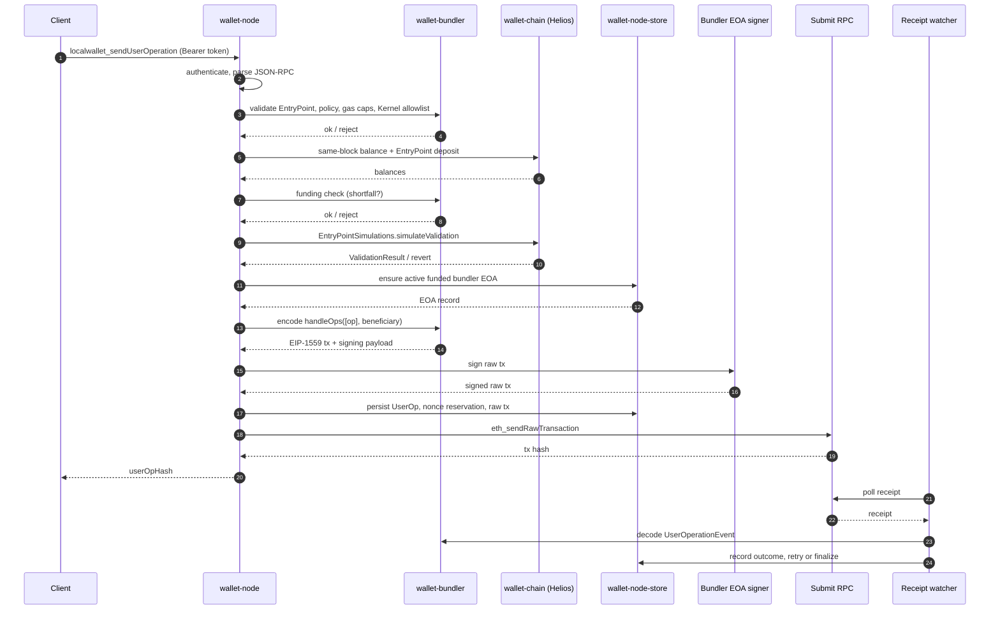

# wallet-node

> **Status:** Open source under MIT/Apache-2.0. App-coupled, pre-1.0. The public JSON-RPC surface and stability policy are documented in `crates/wallet-node-api/README.md`. Internal types in this crate may move between releases.

`wallet-node` is the Local Wallet daemon. It exposes a small authenticated JSON-RPC surface for wallet health, verified Ethereum reads, ENS resolution, Uniswap v3 swap quotes, ERC-4337 UserOperation estimation/submission, bundler EOA management, pending-operation inspection, cancellation, and shutdown.

The daemon is designed to run locally beside the macOS app. The app owns the durable bundler EOA secret in its Keychain; the daemon only holds app-provided relayer secrets in process RAM while it handles Helios verified reads, policy checks, SQLite persistence, raw `handleOps` submission, and receipt watching.

## Current Scope

Supported now:

- Ethereum mainnet and Ethereum Sepolia by explicit mode
- EntryPoint v0.7
- app-pinned Kernel factory, implementation, and WebAuthn validator addresses
- chain-scoped account-code allowlist for the current Kernel path
- Kernel permission/session-key UserOperations for the pinned account path
- no paymasters
- local smart-account funding checks using account balance plus EntryPoint deposit
- ETH-transfer execution path in fork coverage
- ENS resolution with CCIP Read support
- exact-input Uniswap v3 swap quote helper for mainnet and Sepolia, using the configured execution RPC directly for quote `eth_call`s
- app-owned Keychain storage for the bundler EOA secret on macOS, with daemon RAM-only signing after startup/install

Not supported in V1:

- user-configurable chains beyond mainnet/Sepolia, EntryPoints, Kernel modules, or account addresses
- paymaster UserOperations
- EntryPoint deposit management or reclaim UX
- recovery after Secure Enclave/WebAuthn key loss
- live signed-manifest promotion
- generic Kernel permission/hook/executor/fallback module enumeration beyond the explicit session-key permission path

## Threat Model

This is the model the daemon's design assumes. If your deployment violates these assumptions, the safety properties below do not hold. For *why* the daemon is shaped this way, see [`documentation/architecture.md`](../../documentation/architecture.md) — in particular [What the privacy/security boundary actually defends](../../documentation/architecture.md#what-the-privacysecurity-boundary-actually-defends).

### Assumed environment

- Single-user, single-machine.
- Daemon is spawned by a trusted parent (today: the Local Wallet macOS app). The spawn-with-fd lifecycle is documented in [`wallet-macos/Sources/Spawn/README.md`](https://github.com/Ethereum-dAI/local-wallet-mac/blob/main/wallet-macos/Sources/Spawn/README.md); the rationale is in [Why the spawn-with-fd lifecycle?](../../documentation/architecture.md#why-the-spawn-with-fd-lifecycle).
- Loopback HTTP transport is for development. Non-loopback binds are refused by default; pass `--allow-public` to opt in. See `wallet-node/src/transport/http.rs` for the bind validation.
- The OS process boundary is the security boundary between the daemon and other processes on the same machine.

### What the daemon protects

- The bundler EOA private key is held only in process RAM after install/rotate. The durable copy lives in the macOS app's Keychain; rationale in [Why bundler-EOA-in-RAM with app-side Keychain durability?](../../documentation/architecture.md#why-bundler-eoa-in-ram-with-app-side-keychain-durability).
- Mutating admin RPCs require a single-use challenge from `wallet_beginAdminAction`, bound to `(action, ownerScope, chainId, keyRef)`, with a 60-second TTL.
- Status and read RPCs never return private key material.
- Verified Ethereum reads via Helios — the consensus-layer signed state root constrains what an execution RPC can lie about. Rationale in [Why Helios](../../documentation/architecture.md#why-helios-not-trusted-rpc-not-a-full-node).
- The fail-closed simulation rule: if the stateOverride smoke check fails, simulation-dependent sends are rejected. Rationale in [Why fail-closed simulation?](../../documentation/architecture.md#why-fail-closed-simulation).

### What the daemon does not protect against

- A compromised macOS app. The app holds the bearer token, the durable Keychain copy of the bundler EOA secret, and the user's biometric gate; if it is compromised, the daemon's authentication does not save you.
- A compromised parent process more broadly. The daemon's auth is the bearer token the parent receives; anyone who reads that token can call the daemon.
- A second user on the same machine who reads the bearer token from logs, shell history, or process arguments.
- A hostile execution or consensus RPC. Helios verifies execution data against consensus signatures; if both providers are colluding and the consensus checkpoint is stale, the daemon may serve stale-but-internally-consistent reads.
- Tampering with the SQLite store at rest. The store is not encrypted; it carries operational state, no secret material.
- Long-running persistence of the bundler EOA secret in process memory. The secret is in RAM; a memory snapshot of a running daemon contains it.

### Out of scope

- Multi-tenant deployment.
- Public network exposure.
- Recovery after Secure Enclave / WebAuthn key loss.
- Resistance to a malicious user of their own machine.

## Run Modes

Loopback HTTP for manual development:

```bash
cargo run -p wallet-node -- --http 127.0.0.1:0 --print-ready --debug
```

The daemon prints a ready JSON object with:

- `apiVersion`
- `token`
- `httpAddr`

Use the token as a bearer token:

```bash
curl -s \
  -H "Authorization: Bearer <token>" \
  -H "Content-Type: application/json" \
  --data '{"jsonrpc":"2.0","id":1,"method":"wallet_health","params":[]}' \
  http://<httpAddr>
```

Unix-socket app integration:

```text
wallet-node --ready-fd 3 --alive-fd 4
```

The app launches this mode through `wallet-macos/Sources/Spawn`. The daemon writes its ready JSON to fd `3` and watches fd `4` for EOF so it exits when the parent app dies.

Other useful flags:

```text
--config <PATH>              Load TOML config from a custom path
--secret-fd <fd>             Inherit fd over which the parent supplies the bundler-EOA secret at spawn (requires --ready-fd)
--allow-public               Allow binding --http to a non-loopback address (requires --http)
--print-api-version          Print wallet-node-api version and exit
--debug                      Enable debug logging
--manifest-url <URL>         Debug-only manifest URL override; promotion is disabled in this build
```

`--print-ready` requires `--http`; the inverse is not enforced — `--http` runs without `--print-ready`.

## Admin Subcommand

The same daemon binary exposes an operator-facing CLI under the `admin` subcommand, which talks to a running daemon over the existing JSON-RPC surface (HTTP or Unix socket) using the bearer token:

```text
wallet-node admin --socket <PATH> --token <TOKEN> audit [--persist]
wallet-node admin --socket <PATH> --token <TOKEN> audit-history [--limit N]
wallet-node admin --socket <PATH> --token <TOKEN> audit-report --run-id <ID>
wallet-node admin --socket <PATH> --token <TOKEN> repair --action <ACTION> [...]
wallet-node admin --socket <PATH> --token <TOKEN> pending
```

Either `--http <URL>` or `--socket <PATH>` selects transport; `--token <STRING>` or `--token-file <PATH>` provides the bearer token; `--json` opts into machine-readable output. Repair actions and their gating to specific findings are documented under "Audit and Repair" below.

## Configuration

If no config file exists, defaults are used.

Minimal example:

```toml
[network]
chain_id = 1
execution_rpc = "https://ethereum-rpc.publicnode.com"
consensus_rpc = "https://lodestar-mainnet.chainsafe.io"
read_verification = "helios"

[bundler]
entry_points = ["0x0000000071727De22E5E9d8BAf0edAc6f37da032"]
submit_rpcs = ["https://ethereum-rpc.publicnode.com"]
use_precompiled = false
beneficiary = ""

[policy]
max_user_ops_per_bundle = 1
max_call_gas_limit = "0x989680"
max_verification_gas_limit = "0x4c4b40"
max_pre_verification_gas = "0x0f4240"
max_fee_per_gas = "0x2540be400"
max_priority_fee_per_gas = "0x3b9aca00"
min_replacement_bump_pct = 12.5
max_request_body_bytes = 262144
```

Notes:

- `network.read_verification` selects how execution-layer reads are served. `"helios"` (the default) runs the Helios light client and verifies reads against signed beacon consensus state, so a hostile execution RPC cannot forge values. `"execution_rpc"` serves reads directly from the execution RPC with no light-client verification — faster, but you trust that RPC. The send path still requires the chain synced regardless of mode.
- `bundler.beneficiary` must be empty or omitted. The beneficiary is implicit and must equal the active bundler EOA.
- `[chain]` can optionally override `[network]` for Helios internals during tests or compatibility work.
- fee caps are safety caps. Recheck them against live mainnet before release.
- default bundler EOA cushion/threshold values are development defaults. Recheck before release.
- `policy.max_request_body_bytes` (default `262144`) is enforced by the transport handler before JSON-RPC parsing; bodies above the cap are rejected with `PAYLOAD_TOO_LARGE`.
- `[rate_limits]` configures token-bucket rate limits per method bucket. Defaults: `eth_sendUserOperation` 3 burst @ 0.166/sec, `eth_estimateUserOperationGas` 10 burst @ 1/sec, `read_methods_total` 20 burst @ 1.66/sec. Methods without a bucket bypass the limiter.

## JSON-RPC Methods

Wallet methods:

- `wallet_apiVersion`
- `wallet_health`
- `wallet_networkStatus`
- `wallet_bundlerStatus`
- `wallet_walletStatus`
- `wallet_pendingOperations`
- `wallet_auditStore`
- `wallet_auditHistory`
- `wallet_auditReport`
- `wallet_repairStore`
- `wallet_cancelPendingOperation`
- `wallet_speedUpPendingOperation`
- `wallet_beginAdminAction`
- `wallet_rotateBundlerEOA`
- `wallet_installBundlerEOA`
- `wallet_deleteBundlerEOA`
- `localwallet_resolveName`
- `localwallet_quoteSwap`
- `wallet_shutdown`

`wallet_bundlerStatus` reports the active relayer, balance/threshold, lifecycle,
rotation state, recent relayer-key audit events, and non-secret `keyHistory`
metadata for current and historical relayer keys. It does not expose private key
material.

`wallet_rotateBundlerEOA`, `wallet_installBundlerEOA`, and `wallet_deleteBundlerEOA` require an admin challenge issued by `wallet_beginAdminAction`. Challenges have a 60-second TTL, are single-use, and are bound to `(action, ownerScope, chainId, keyRef)`. The daemon does not itself prompt for user presence — the app is expected to gate the admin call behind a local user-presence check before forwarding the authorization.

`localwallet_resolveName` resolves ENS names to EVM addresses on the active chain and supports CCIP Read. On Sepolia, if the name has no Sepolia-specific EVM address record, the handler can fall back to mainnet ENS resolution for default Ethereum records.

`localwallet_quoteSwap` quotes exact-input Uniswap v3 swaps on mainnet and Sepolia using on-chain factory, pool, liquidity, and QuoterV2 calls through the daemon's chain adapter. It checks direct pools and one-hop routes supplied by the client, returns the best amount out, path, route hops, minimum output after slippage, router/quoter/factory addresses, and allowance status for ERC-20 inputs. It is a read/helper method only; signing and submission still go through `localwallet_sendUserOperation`.

Ethereum read methods:

- `eth_chainId`
- `eth_getBalance`
- `eth_getCode`
- `eth_getTransactionCount`
- `eth_call`
- `eth_getTransactionReceipt`
- `eth_getBlockByNumber`
- `eth_estimateGas`
- `eth_maxPriorityFeePerGas`
- `eth_gasPrice`

ERC-4337/bundler methods:

- `localwallet_supportedEntryPoints`
- `localwallet_estimateUserOperationGas`
- `localwallet_sendUserOperation`
- `localwallet_getUserOperationReceipt`
- `localwallet_getUserOperationStatus`
- `localwallet_getUserOperationGasPrice`

Deprecated one-release aliases (still accepted on the wire, will be removed in a future release): `eth_supportedEntryPoints`, `eth_estimateUserOperationGas`, `eth_sendUserOperation`, `eth_getUserOperationReceipt`, `pimlico_getUserOperationGasPrice`.

The wire method list lives in `wallet-node-api`.

## RPC Quickstart

All requests are JSON-RPC 2.0 over HTTP or Unix socket, authenticated with the bearer token from the ready handshake. The examples below assume HTTP mode and `<token>`/`<addr>` placeholders.

### Auth smoke test

```bash
curl -s \
  -H "Authorization: Bearer <token>" -H "Content-Type: application/json" \
  --data '{"jsonrpc":"2.0","id":1,"method":"wallet_health","params":[]}' \
  http://<addr>
```

Returns an `ok` payload with the daemon's basic state when auth succeeds.

### Chain sync state

```bash
curl -s \
  -H "Authorization: Bearer <token>" -H "Content-Type: application/json" \
  --data '{"jsonrpc":"2.0","id":2,"method":"wallet_networkStatus","params":[]}' \
  http://<addr>
```

Reports `chainId`, `synced`, `networkProfile`, and Helios head/checkpoint state. Use this to confirm verified reads are ready before submitting UserOperations.

### Bundler EOA status

```bash
curl -s \
  -H "Authorization: Bearer <token>" -H "Content-Type: application/json" \
  --data '{"jsonrpc":"2.0","id":3,"method":"wallet_bundlerStatus","params":[]}' \
  http://<addr>
```

Returns active relayer address, balance, lifecycle, low-balance threshold, rotation state, and the non-secret `keyHistory`. Never returns private key material.

### Resolve an ENS name

```bash
curl -s \
  -H "Authorization: Bearer <token>" -H "Content-Type: application/json" \
  --data '{
    "jsonrpc":"2.0","id":4,"method":"localwallet_resolveName",
    "params":[{"name":"vitalik.eth","sendChainId":11155111}]
  }' \
  http://<addr>
```

Returns the normalized name, resolved EVM address, resolver address, resolution chain, record type, coin type, and whether CCIP Read was used.

### Quote an exact-input Uniswap v3 swap

```bash
curl -s \
  -H "Authorization: Bearer <token>" -H "Content-Type: application/json" \
  --data '{
    "jsonrpc":"2.0","id":5,"method":"localwallet_quoteSwap",
    "params":[{
      "sendChainId":11155111,
      "tokenIn":"0x1c7D4B196Cb0C7B01d743Fbc6116a902379C7238",
      "tokenOut":"0xfFf9976782d46CC05630D1f6eBAb18b2324d6B14",
      "amountIn":"0x1e8480",
      "owner":"<smartAccount>",
      "tokenInIsNative":false,
      "slippageBps":100,
      "intermediates":[
        "0xaa8E23Fb1079EA71e0a56F48a2aA51851D8433D0",
        "0x776b6FC2eD15d6bB5fC32e0c89DE68683118c62a"
      ]
    }]
  }' \
  http://<addr>
```

Returns the selected Uniswap v3 path, hop list, `quoteAmountOut`, `amountOutMinimum`, `gasEstimate`, router/quoter/factory addresses, and `requiresApproval` for ERC-20 inputs. `amountIn` is raw token units as a hex quantity. This method does not approve, sign, or submit.

Note: in production, swap quote calls use the configured execution RPC directly with bounded per-call and route timeouts. Quotes are advisory route discovery; UserOperation simulation/submission keeps the stricter policy path.

### Estimate UserOperation gas

```bash
curl -s \
  -H "Authorization: Bearer <token>" -H "Content-Type: application/json" \
  --data '{
    "jsonrpc":"2.0","id":6,"method":"localwallet_estimateUserOperationGas",
    "params":[<packedUserOperation>, "0x0000000071727De22E5E9d8BAf0edAc6f37da032"]
  }' \
  http://<addr>
```

Returns `preVerificationGas`, `verificationGasLimit`, and `callGasLimit`. The daemon rejects with `insufficient_smart_account_balance` or `transferable_below_call_value` if the funding precheck fails before simulation. Root WebAuthn UserOperations are simulated with a WebAuthn dummy signature; permission/session-key UserOperations are simulated with the caller-supplied permission-shaped signature so gas estimates match the validation path.

### Submit a UserOperation

```bash
curl -s \
  -H "Authorization: Bearer <token>" -H "Content-Type: application/json" \
  --data '{
    "jsonrpc":"2.0","id":7,"method":"localwallet_sendUserOperation",
    "params":[<packedUserOperation>, "0x0000000071727De22E5E9d8BAf0edAc6f37da032"]
  }' \
  http://<addr>
```

Returns the `userOpHash`. The daemon persists the UserOp, encodes and signs `handleOps([op], beneficiary)`, submits the raw transaction, and lets the watcher reconcile the receipt. The accepted Kernel nonce-key set is intentionally narrow: root key zero, or permission keys with validation type `0x02`, default/enable mode, and parallel key zero.

### Poll a UserOperation receipt

```bash
curl -s \
  -H "Authorization: Bearer <token>" -H "Content-Type: application/json" \
  --data '{
    "jsonrpc":"2.0","id":8,"method":"localwallet_getUserOperationReceipt",
    "params":["<userOpHash>"]
  }' \
  http://<addr>
```

Returns `null` while the operation is still pending; returns the full receipt once the UserOperationEvent is confirmed on-chain.

## Common Error Codes

JSON-RPC error responses carry a stable `code` (negative integer) plus a string `message`. Domain-specific failures are surfaced as a `data.reason` string. The reasons below show up most often when integrating against the daemon:

| Reason | When |
|---|---|
| `PAYLOAD_TOO_LARGE` | Request body above `policy.max_request_body_bytes` (default 262144). Returned before parse. |
| `RATE_LIMITED` | The method exceeded its configured token-bucket; response includes `retryAfterMs`. |
| `verified_reads_not_ready` | Chain not yet synced through Helios; submission and simulation-dependent estimation are refused. |
| `state_override_smoke_pending` | StateOverride smoke check has not yet succeeded for this process; simulation-dependent paths fail closed. |
| `helios_state_override_unsupported` | StateOverride smoke determined the upstream RPC does not honor `stateOverride` correctly. |
| `bundler_eoa_needs_topup` | Active relayer balance below the low-balance threshold (default 0.005 ETH). |
| `bundler_eoa_compromise_suspected` | Drained relayer detected (previously above threshold, now near zero with no pending tx). Blocks submission until cleared. |
| `insufficient_smart_account_balance` | Smart-account balance + EntryPoint deposit cannot cover `requiredPrefund`. |
| `transferable_below_call_value` | Decoded ERC-7579 call value exceeds the account's spendable ETH (EntryPoint deposit is not spendable). |
| `entrypoint_deposit_management_unsupported` | A single-call UserOp targets `EntryPoint.withdrawTo` — explicitly rejected; deposit/reclaim UX is out of V1. |
| `paymaster_not_supported` | UserOp carries paymaster fields; paymasters are out of scope. |
| `factory_not_allowed_for_deployed_sender` | `initCode` provided for a sender that already has code. |
| `malformed_webauthn_signature` / `signature_missing` | Root-path signature shape fails the WebAuthn 6-field decode, or no signature was supplied. Permission/session-key UserOperations skip the WebAuthn verifier-code check and rely on on-chain permission validation. |
| `replacement_not_possible` | Cancellation/replacement attempted on a UserOp not in a replaceable state (e.g. already terminal). |
| `gas_relay_stuck` | Legacy replacement-cap reason. Current cancel and speed-up replacements use live gas to clear the relayer nonce. |
| `relayer_rotated_during_send` | The active bundler EOA changed mid-flight between policy and submission. |
| `admin_authorization_required` / `admin_challenge_*` | Mutating admin RPC called without a valid challenge from `wallet_beginAdminAction`, or the challenge is bound to a different `(action, ownerScope, chainId, keyRef)`. |

The exhaustive list — including audit/repair-specific reasons — lives alongside the handlers in `crates/wallet-node/src/handlers/`.

## Internal Flow

`localwallet_sendUserOperation` roughly follows this path:

1. authenticate and parse JSON-RPC
2. validate EntryPoint, chain, no-paymaster policy, request size, rate limits, gas caps, and fixed Kernel allowlist
3. read same-block account balance and EntryPoint deposit
4. reject smart-account gas/value shortfalls before submission
5. run EntryPointSimulations when verified reads are available
6. ensure an active funded bundler EOA exists
7. sign an EIP-1559 `handleOps([op], beneficiary)` raw transaction
8. persist the UserOp, nonce reservation, and submitted tx
9. submit the raw transaction
10. watcher reconciles receipts, retries persisted submissions, and records UserOperationEvent outcomes



## Persistence

The daemon uses `wallet-node-store` with SQLite. It persists:

- bundler EOA records and lifecycle state
- UserOperations
- raw submitted transactions
- nonce reservations
- verified UserOperation receipts
- daemon metadata, including compromise-detection markers

## Tests

Default daemon tests:

```bash
cargo test -p wallet-node
```

Host/socket ignored tests:

```bash
cargo test -p wallet-node -- --include-ignored
```

Mainnet fork fixture from repository root:

```bash
ETH_RPC_URL=https://your-mainnet-rpc.example \
WALLET_FORK_BLOCK_NUMBER=25001071 \
./scripts/run-kernel-mainnet-fork-check.sh
```

The fork fixture validates the app-pinned Kernel path, real EntryPointSimulations state override, deterministic WebAuthn signing, ETH-transfer `handleOps`, and 50-send bundler flatness.

## Operational Notes

- Helios is pinned in the workspace and should not be routine-bumped.
- The daemon fails closed when stateOverride smoke fails for simulation-dependent sends. The smoke check is one-shot per process: it runs after the chain becomes synced and is not re-run periodically — appropriate for a session-scoped daemon.
- If Helios checkpoint data is stale, the daemon can start with an offline chain adapter for authenticated control APIs while verified reads are degraded.
- Production Keychain access-group entitlement and provisioning validation remain outside the development fallback until Apple Developer Program setup is available.
- Signed-manifest scaffolding exists in `wallet-bundler::manifest` (Ed25519 signature verification, 30-day max lifetime, denylist precedence) but no production trust roots are embedded; runtime promotion is disabled in non-debug builds, and the runtime allowlist consults only the static, chain-scoped pinned set.
