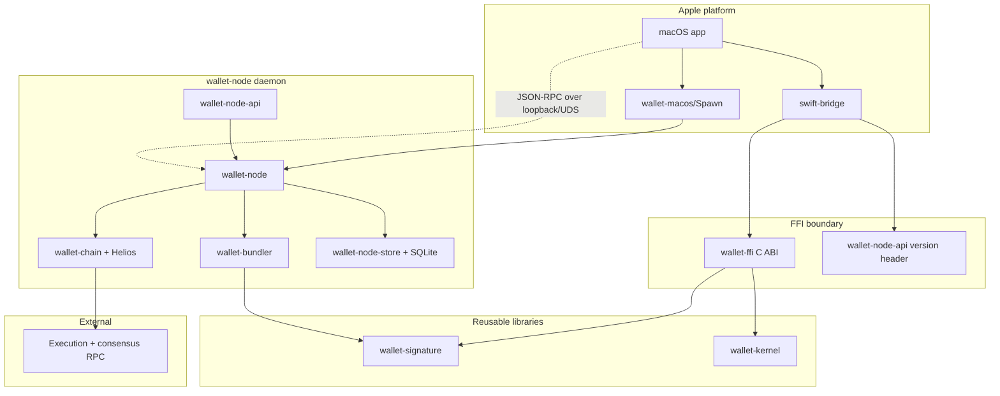

# rust-core

`rust-core` is the Rust workspace for Local Wallet's protocol, daemon, storage, and FFI layers.

It contains both reusable crates and app-internal infrastructure. The reusable pieces are `wallet-signature` and `wallet-kernel`; the daemon stack is currently internal to this repository.

## Workspace Crates

| Crate | Purpose |
|---|---|
| `wallet-signature` | EntryPoint v0.7 UserOperation hashing, WebAuthn message construction, P-256 low-s normalization, and Kernel WebAuthn signature encoding. |
| `wallet-kernel` | Kernel WebAuthn account initialization, CREATE2 salt derivation, Solady ERC-1967 init-code hashing, and counterfactual address prediction. |
| `wallet-ffi` | Internal C ABI bridge for Swift consumers. |
| `wallet-chain` | Helios-backed verified chain adapter, JSON-RPC wire types, stateOverride smoke test, and mock chain adapter. |
| `wallet-bundler` | ERC-4337 UserOperation parsing, policy, gas, EntryPoint v0.7 helpers, Kernel allowlist, simulations, raw tx helpers, and watcher logic. |
| `wallet-node-api` | JSON-RPC method names, error codes, request body parsing, and generated API version header. |
| `wallet-node-store` | SQLite schema, migrations, typed repositories, and async store actor. |
| `wallet-node` | Local daemon binary combining chain reads, bundler policy, signing, persistence, transports, and watchers. |

## Build And Test

Run the full default Rust test suite:

```bash
cargo test --workspace
```

Build the daemon as it would be shipped locally:

```bash
cargo build -p wallet-node --release --locked
```

Run focused crate tests:

```bash
cargo test -p wallet-signature
cargo test -p wallet-kernel
cargo test -p wallet-bundler
cargo test -p wallet-chain
cargo test -p wallet-node-store
cargo test -p wallet-node-api
cargo test -p wallet-node
```

Some host/socket and fork tests are ignored by default. Run them intentionally:

```bash
cargo test -p wallet-node-store -p wallet-node -- --include-ignored
```

The mainnet-fork Kernel fixture is normally run through the repository script:

```bash
cd ..
ETH_RPC_URL=https://your-mainnet-rpc.example \
WALLET_FORK_BLOCK_NUMBER=25001071 \
scripts/run-kernel-mainnet-fork-check.sh
```

## Helios Pin

`helios-ethereum` and `helios-core` are pinned in `Cargo.toml` to:

```text
204c998a927348e1c000a664f08d5b37b1b0d924
```

Policy: keep the current working pin fixed. Do not routine-bump Helios. Only update it for an explicit security, correctness, or required-compatibility reason, and re-run the real stateOverride smoke plus deterministic mainnet-fork fixture before merging.

## Generated Swift Bridge

The Swift bridge consumes `wallet-ffi` through a generated header and static library. From the repository root:

```bash
./scripts/build-ffi.sh
```

That builds `wallet-ffi` for `aarch64-apple-darwin`, runs `cbindgen`, copies the generated `wallet-node-api` version header, and stages the static library under `swift-bridge/`.

## Boundaries

Reusable library surface:

- `wallet-signature`
- `wallet-kernel`

Daemon/internal surface:

- `wallet-node`
- `wallet-bundler`
- `wallet-chain`
- `wallet-node-api`
- `wallet-node-store`
- `wallet-ffi`

The daemon is scoped to Ethereum mainnet/Sepolia, EntryPoint v0.7, and the app's fixed Kernel/WebAuthn account path for now.

## Workspace Layering

How the crates compose across the Apple, FFI, and daemon layers (structural, not a runtime sequence):


