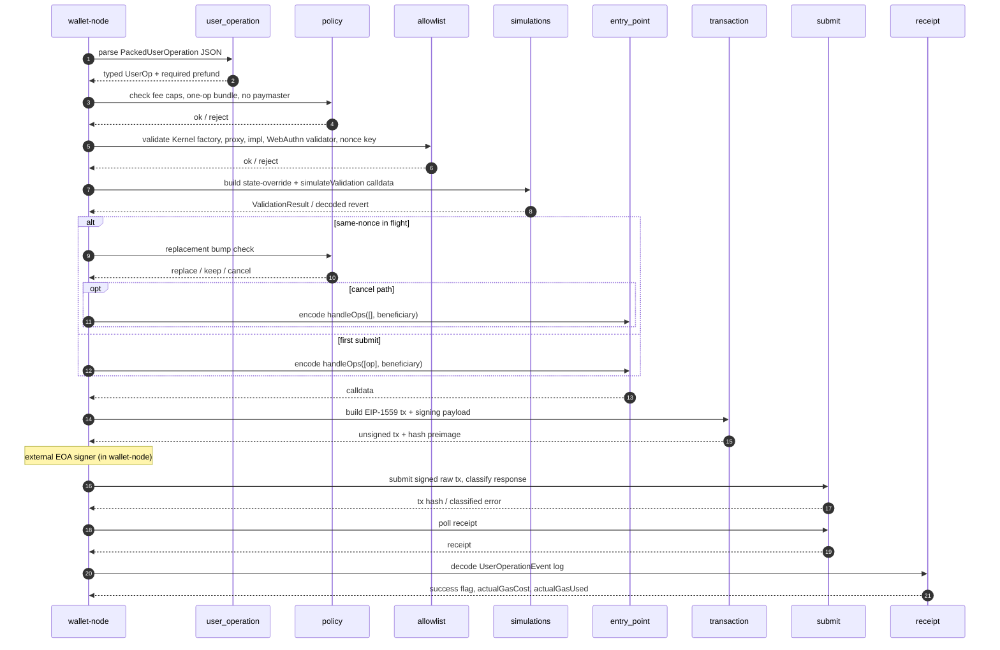

# wallet-bundler

`wallet-bundler` is the daemon's ERC-4337 policy and transaction library.

It does not run a server and does not own secrets. It provides deterministic helpers used by `wallet-node` for parsing UserOperations, enforcing local policy, validating the app-pinned Kernel account path, simulating EntryPoint validation, building raw `handleOps` transactions, decoding receipts, and deciding replacement/cancel behavior.

## Main Responsibilities

- Parse and normalize EntryPoint v0.7 `PackedUserOperation` JSON.
- Compute local gas estimates from EntryPoint validation data.
- Expose Pimlico-shaped gas price responses from configured policy caps.
- Enforce bundler policy, including fee caps, one-op bundles, no paymasters, and replacement bump limits.
- Validate the current mainnet/Sepolia Kernel allowlist:
  - pinned Kernel factory address + chain-scoped factory code hash
  - pinned Kernel implementation address + chain-scoped implementation code hash
  - pinned WebAuthn validator address + chain-scoped validator code hash
  - deterministic Solady ERC-1967 proxy runtime + ERC-1967 implementation slot
  - pinned WebAuthn root validator id resolved from `rootValidator()`
  - nonce key zero
- Encode EntryPoint v0.7 calls:
  - `handleOps([op], beneficiary)`
  - `handleOps([], beneficiary)` for cancel replacements
  - `simulateValidation(op)`
- Embed and verify the EntryPointSimulations v0.7 runtime bytecode.
- Decode `ValidationResult` and EntryPoint simulation reverts.
- Build and hash EIP-1559 raw transactions.
- Interpret `eth_sendRawTransaction` and receipt RPC responses.
- Decode `UserOperationEvent` receipt logs.
- Provide local funding arithmetic and ERC-7579 single-call execution decoding.
- Decide same-nonce replacement eligibility.

## Current Protocol Scope

Supported:

- Ethereum mainnet and Sepolia assumptions
- EntryPoint v0.7
- no paymasters
- app-shaped Kernel WebAuthn accounts
- ERC-7579 single execution decoding for value-transfer checks
- ETH transfer fork coverage

Not a generic bundler:

- no mempool
- no public P2P
- no arbitrary module resolver
- no multi-EntryPoint routing
- no paymaster support
- no batch/delegate/executor/fallback allowlist coverage yet

## Important Modules

| Module | Purpose |
|---|---|
| `user_operation` | JSON parsing, field packing, required prefund, dummy WebAuthn signature. |
| `policy` | UserOp policy, fee invariants, replacement bump rules. |
| `allowlist` | Pinned Kernel factory/proxy/implementation/WebAuthn validator checks. |
| `simulations` | EntryPointSimulations runtime, state override, revert decoding, validation result checks. |
| `entry_point` | `handleOps` and empty cancel calldata. |
| `transaction` | EIP-1559 tx request, signing payload, raw transaction encoding, tx hash. |
| `submit` | Raw transaction submit and receipt RPC request/response classification. |
| `receipt` | `UserOperationEvent` topic and ABI-data decoding. |
| `funding` | Smart-account minimum balance, shortfall, top-up display helpers. |
| `execution` | ERC-7579 single-call and EntryPoint `withdrawTo` decoding. |
| `manifest` | Ed25519-verifying signed-manifest schema with 30-day max lifetime, denylist precedence, and effective-additions lookup. Runtime promotion is disabled in non-debug daemon builds and the runtime allowlist resolver does not consult manifest additions today. |
| `watcher` | Same-nonce replacement-candidate helpers and post-submit receipt reconciliation (`reconcile_once`) used by the daemon's receipt watcher. |

## Module Flow

How `wallet-node` drives these modules for a single UserOperation:



## Tests

```bash
cd rust-core
cargo test -p wallet-bundler
```

The deployed-contract fork coverage is in `wallet-node` because it needs a running Anvil fork and daemon-shaped integration context:

```bash
ETH_RPC_URL=https://your-mainnet-rpc.example \
WALLET_FORK_BLOCK_NUMBER=25001071 \
scripts/run-kernel-mainnet-fork-check.sh
```

## Relationship To wallet-node

`wallet-node` owns runtime concerns:

- authentication
- transport
- config
- Keychain-backed bundler EOA signing
- Helios adapter
- SQLite store
- background watchers

`wallet-bundler` owns deterministic protocol logic that can be tested without a daemon process.
