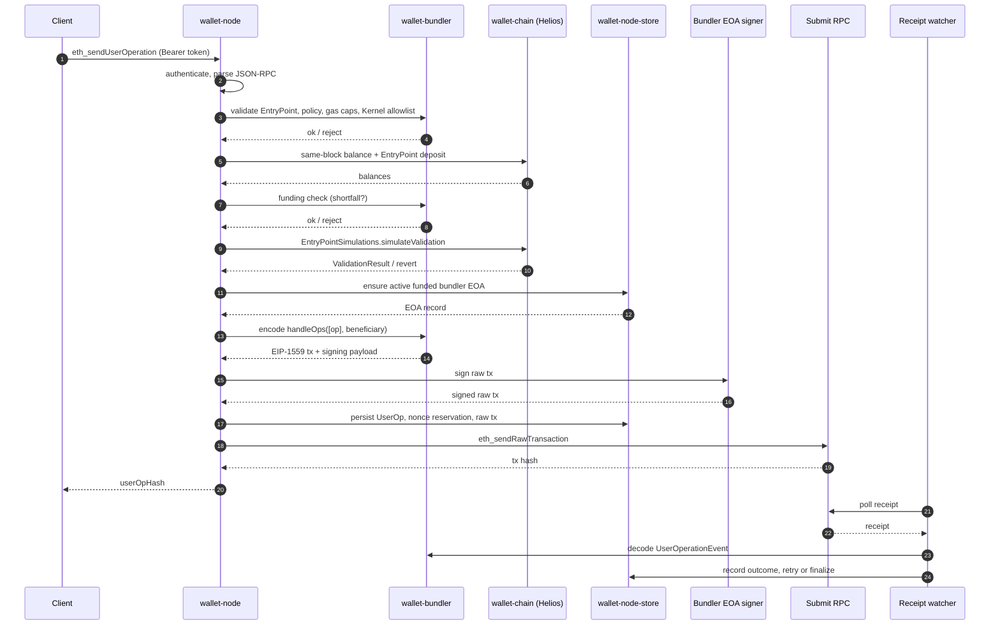

# wallet-node

`wallet-node` is the Local Wallet daemon. It exposes a small authenticated JSON-RPC surface for wallet health, verified Ethereum reads, ERC-4337 UserOperation estimation/submission, bundler EOA management, pending-operation inspection, cancellation, and shutdown.

The daemon is designed to run locally beside the macOS app. It owns the local bundler EOA secret, Helios verified reads, policy checks, SQLite persistence, raw `handleOps` submission, and receipt watching.

## Current Scope

Supported now:

- Ethereum mainnet
- EntryPoint v0.7
- app-pinned Kernel factory, implementation, and WebAuthn validator addresses
- fixed mainnet account-code allowlist for the current Kernel path
- no paymasters
- local smart-account funding checks using account balance plus EntryPoint deposit
- ETH-transfer execution path in fork coverage
- development Keychain storage for the bundler EOA secret on macOS

Not supported in V1:

- user-configurable chains, EntryPoints, Kernel modules, or account addresses
- paymaster UserOperations
- EntryPoint deposit management or reclaim UX
- recovery after Secure Enclave/WebAuthn key loss
- live signed-manifest promotion
- generic Kernel permission/hook/executor/fallback module enumeration

## Run Modes

Loopback HTTP for manual development:

```bash
cd rust-core
cargo run -p wallet-node -- --http 127.0.0.1:0 --print-ready --debug
```

The daemon prints a ready JSON object with:

- `apiVersion`
- `token`
- `httpAddr`

Use the token as a bearer token:

```bash
curl -s \
  -H "Authorization: Bearer <token>" \
  -H "Content-Type: application/json" \
  --data '{"jsonrpc":"2.0","id":1,"method":"wallet_health","params":[]}' \
  http://<httpAddr>
```

Unix-socket app integration:

```text
wallet-node --ready-fd 3 --alive-fd 4
```

The app launches this mode through `wallet-macos/Sources/Spawn`. The daemon writes its ready JSON to fd `3` and watches fd `4` for EOF so it exits when the parent app dies.

Other useful flags:

```text
--config <PATH>              Load TOML config from a custom path
--print-api-version          Print wallet-node-api version and exit
--debug                      Enable debug logging
--manifest-url <URL>         Debug-only manifest URL override; promotion is disabled in this build
```

## Configuration

If no config file exists, defaults are used.

Minimal example:

```toml
[network]
chain_id = 1
execution_rpc = "https://ethereum-rpc.publicnode.com"
consensus_rpc = "https://lodestar-mainnet.chainsafe.io"

[bundler]
entry_points = ["0x0000000071727De22E5E9d8BAf0edAc6f37da032"]
submit_rpcs = ["https://ethereum-rpc.publicnode.com"]
use_precompiled = false
beneficiary = ""

[policy]
max_user_ops_per_bundle = 1
max_call_gas_limit = "0x989680"
max_verification_gas_limit = "0x4c4b40"
max_pre_verification_gas = "0x0f4240"
max_fee_per_gas = "0x2540be400"
max_priority_fee_per_gas = "0x3b9aca00"
min_replacement_bump_pct = 12.5
max_request_body_bytes = 262144
```

Notes:

- `bundler.beneficiary` must be empty or omitted. The beneficiary is implicit and must equal the active bundler EOA.
- `[chain]` can optionally override `[network]` for Helios internals during tests or compatibility work.
- fee caps are safety caps. Recheck them against live mainnet before release.
- default bundler EOA cushion/threshold values are development defaults. Recheck before release.

## JSON-RPC Methods

Wallet methods:

- `wallet_health`
- `wallet_networkStatus`
- `wallet_bundlerStatus`
- `wallet_walletStatus`
- `wallet_pendingOperations`
- `wallet_cancelPendingOperation`
- `wallet_rotateBundlerEOA`
- `wallet_shutdown`

Ethereum read methods:

- `eth_getBalance`
- `eth_getCode`
- `eth_getTransactionCount`
- `eth_call`
- `eth_getTransactionReceipt`
- `eth_getBlockByNumber`
- `eth_estimateGas`
- `eth_maxPriorityFeePerGas`
- `eth_gasPrice`

ERC-4337/bundler methods:

- `eth_supportedEntryPoints`
- `eth_estimateUserOperationGas`
- `eth_sendUserOperation`
- `eth_getUserOperationReceipt`
- `pimlico_getUserOperationGasPrice`

The wire method list lives in `wallet-node-api`.

## Internal Flow

`eth_sendUserOperation` roughly follows this path:

1. authenticate and parse JSON-RPC
2. validate EntryPoint, chain, no-paymaster policy, request size, rate limits, gas caps, and fixed Kernel allowlist
3. read same-block account balance and EntryPoint deposit
4. reject smart-account gas/value shortfalls before submission
5. run EntryPointSimulations when verified reads are available
6. ensure an active funded bundler EOA exists
7. sign an EIP-1559 `handleOps([op], beneficiary)` raw transaction
8. persist the UserOp, nonce reservation, and submitted tx
9. submit the raw transaction
10. watcher reconciles receipts, retries persisted submissions, and records UserOperationEvent outcomes



## Persistence

The daemon uses `wallet-node-store` with SQLite. It persists:

- bundler EOA records and lifecycle state
- UserOperations
- raw submitted transactions
- nonce reservations
- verified UserOperation receipts
- daemon metadata, including compromise-detection markers

## Tests

Default daemon tests:

```bash
cd rust-core
cargo test -p wallet-node
```

Host/socket ignored tests:

```bash
cargo test -p wallet-node -- --include-ignored
```

Mainnet fork fixture from repository root:

```bash
ETH_RPC_URL=https://your-mainnet-rpc.example \
WALLET_FORK_BLOCK_NUMBER=25001071 \
scripts/run-kernel-mainnet-fork-check.sh
```

The fork fixture validates the app-pinned Kernel path, real EntryPointSimulations state override, deterministic WebAuthn signing, ETH-transfer `handleOps`, and 50-send bundler flatness.

## Operational Notes

- Helios is pinned in the workspace and should not be routine-bumped.
- The daemon fails closed when stateOverride smoke fails for simulation-dependent sends.
- If Helios checkpoint data is stale, the daemon can start with an offline chain adapter for authenticated control APIs while verified reads are degraded.
- Production Keychain access-group entitlement and provisioning validation remain outside the development fallback until Apple Developer Program setup is available.
