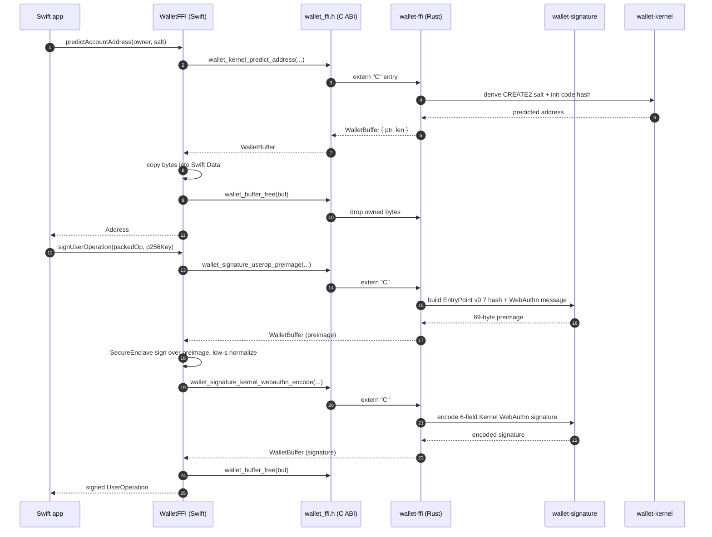

# swift-bridge

Swift wrapper over the internal `wallet-ffi` C ABI.

This package is the Apple-facing layer for:

- UserOperation hashing
- WebAuthn signing-preimage construction
- P-256 low-s normalization
- Kernel/WebAuthn signature encoding
- dummy Kernel/WebAuthn signature encoding for gas estimation
- Kernel account initialization helpers and address prediction

## Important Setup

This package depends on generated bridge artifacts and does not commit them to git.

Before building or testing the package from a fresh clone, run:

```bash
./scripts/build-ffi.sh
```

That script generates:

- `Sources/WalletFFI/wallet_ffi.h`
- `Sources/WalletFFI/wallet_node_api_version.h`
- `lib/libwallet_ffi.a`

After that, you can run:

```bash
swift test
```

## Boundary

`swift-bridge` is the intended Apple-platform entry point.

It is built on top of:

- `rust-core/crates/ffi` (local — internal C ABI bridge)
- `wallet-signature` and `wallet-kernel` — protocol SDK crates that resolve via git dependency from [`local-wallet-protocol`](https://github.com/Ethereum-dAI/local-wallet-protocol)
- `wallet-node-api` — version header only; resolves via git dependency from [`local-wallet-daemon`](https://github.com/Ethereum-dAI/local-wallet-daemon)

It does not launch or manage the daemon directly. Daemon process spawning lives in `wallet-macos/Sources/Spawn` and `wallet-macos/Sources/SpawnHelper`.

## Local Development

For monorepo-style local development, copy `rust-core/.cargo/config.toml.example` to `rust-core/.cargo/config.toml` and ensure `local-wallet-protocol` and `local-wallet-daemon` are checked out as siblings of this repo. The example config file contains `[patch.crates-io]` overrides that redirect the git dependencies to your local checkouts.

## Call Flow

Address prediction and UserOperation signing across the FFI boundary, including buffer ownership:


